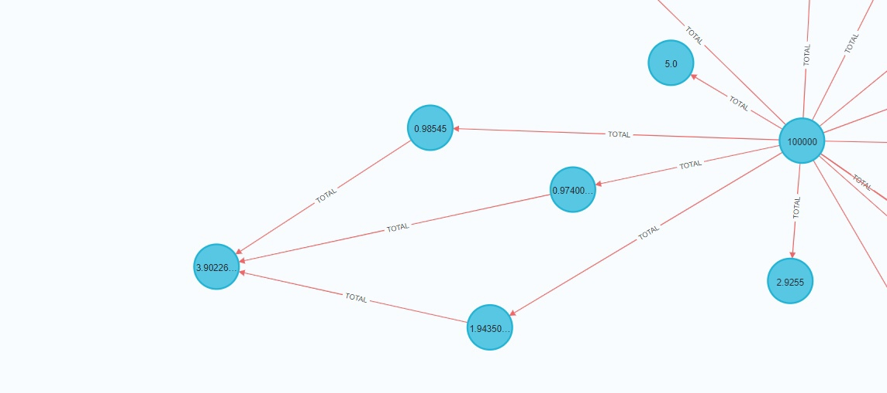

# Поток в графе для анализа блокчейн

Представим, что блокчейн сохранён в виде графа, вершины - это адреса, рёбра - транзакции. И пусть у каждой транзакции сохранена её сумма. 

Нода, отмеченная 100000, - это миксер на основе zk-protocol технологии. На левую вершин через промежуточные на неё было переведено 4 ETH (- комиссия). Хочется подсчитать, сколько таким образом через посредников для каждого адреса могло быть потенциально переведено с миксера, и сколько, наоборот, было потенциально переведено на миксер. Тогда совпадающие числа могут свидетелствовать об использовании миксера для перевода между данными адресами с помощью миксера. 

Обратимся к теории потоков и сетей ([wiki](https://en.wikipedia.org/wiki/Flow_network)). Поставим на каждом ребре пропускную способность, равную его сумме. Пусть пользователь как-то "окольными путями" с адреса $S$, на котором аггрегировал средства, перевел на миксер $M$ эфир в размере $v$. Если бы он переводил каждый раз ровно столько, чтобы на промежуточных адресах баланс не менялся (не увеличивался) при прочих равных, то он бы перевел не больше, чем на самом деле в каждой транзакции. Например, пусть он отправил 3 эфира на $A$ и $B$, с $A$ перевел 2 эфира на $M$, с $B$ отправил 1 эфир на $C$ и столько же оттуда на $M$. Тогда он мог бы отправить 1 эфир на $B$, потом на $C$ и $M$, а на $A$ можно было бы отправить 2. Такой гипотетический вариант движения эфира в итоге приводит к поступлению на $M$ такой же суммы, но является ещё и потоком в заданной сети. Таким образом, максимальный потенциальный объём переведенных на миксер средств равен величине максимального потока в сети.

Для анализа можно вычислять потоки на/от миксер и искать соответсвия. 

-----

Задача вычисления максимального потока относительно времязатратна и труднореализуема в neo4j на чистом cypher. Для оптимизации вычислений есть несколько разных эфристик. Во-первых, можно при загрузке блокчейн в граф сканировать ребре от миксера строя направленное дерево, ведь если от $A$ любой путь до $M$ идёт через $B$ или его нет, то ребро $B->A$ не влияет на максимальный поток из $B$ в $M$. Во-вторых, можно топологически отсортировать вершины такого дерева для дальнейшего удобства. Однако в графе могут быть циклы, для решения этого вопроса есть 2 подхода: 
- Игнорировать одно из рёбер цикла, так потеряется лишь малая часть информации о движении средств, однако с учетом невозможности получения точной информации обо всем, это не критично. При этом если не рассматривать в графе адреса бирж (а биржа не будет переводить средства на миксер), то таких циклов очень мало: на практике при использовании этого подхода на нескольких tornado-миксерах и тысячах адресов цикл был обнаружен 1 раз. 

- Стягивать компоненты сильной связности. Если обнаружен кластер адресов, не содержащий биржи, адреса токенов и т.д., который образует сильно связный орграф, то можно предполодить, что контроль над адресами осуществляется пользователем или взаимодействующей вне блокчейн группой пользователей, что делает осмысленным рассмотрение суммарных потоков от этих адресов.

В-третьих, можно вычислить не поток, а суммарную пропускную способность всех путей до $M$. Эта величина точно не меньше потока, ведь размер максимального потока равен минимальному разрезу, который в свою очередь сожержит хоть по 1 ребру каждого из путей. Для ситуаций как на картине выше данная величина равна потоку, ведь пути независимы. В общем случае, такая сумма ("псевдопоток") равна максимальному потоку, если пути независимы. При неаккуратном переводе средств на миксер даже через адреса-посредники без множественного ветвления это верно. Если псевдопоток боьлше максимального потока, то существует ребро $X->Y$ с пропускной способностью меньшей, чем сумма пропускных способностей путей, лежащих после него. Это означает, что где-то между $Y$ и $M$ происходит разделение средств, тогда, вероятнее всего, $X$ - это не адрес, от которого средства идут на $M$ распределенно, а адрес, с точки зрения действий пользователя не связанный с миксером.
